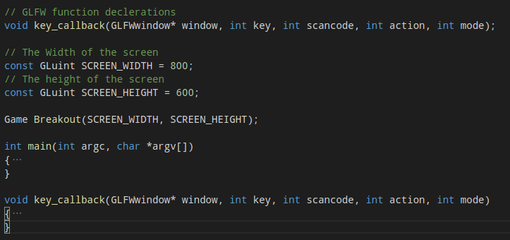
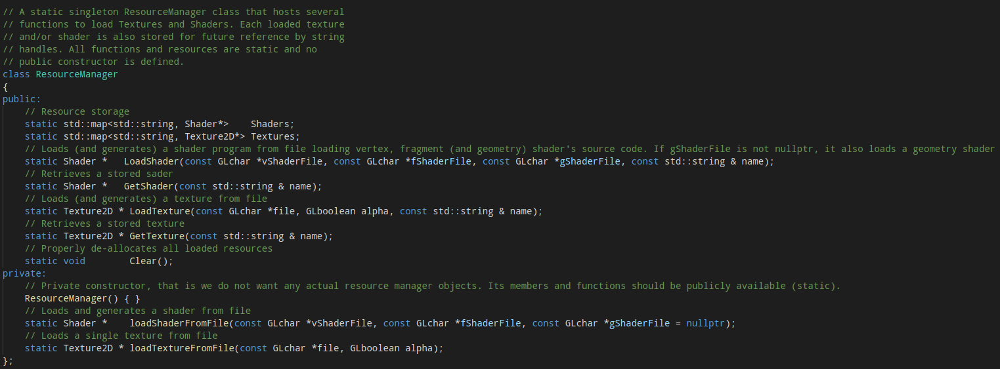
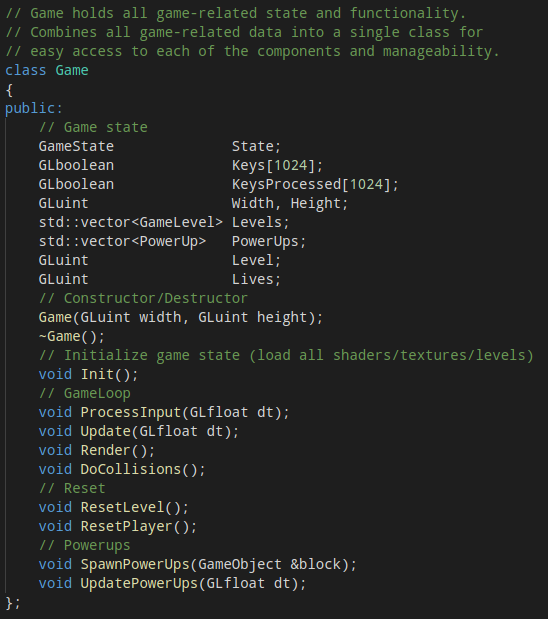

# HW4 利用OpenGL设计贪吃蛇游戏

#### 任务介绍
- 贪吃蛇游戏：玩家控制贪吃蛇在游戏区域里驰骋，避免碰到自己或障碍物，尽可能地吃更多的食物以生长！

##### 游戏玩法：
- WASD控制蛇的移动
- 游戏开始，每隔一定时间会在地图空闲位置刷新一个食物，蛇触碰到食物后食物消失，蛇会增加一个单位的长度
- 当蛇触碰到自己或者障碍物，则游戏失败
- 当蛇接触到地图边界，蛇会在地图另一端重新进入地图

#### 开发环境
- OpenGL3
- GLFW
- GLAD

#### Tips 一个简单的贪吃蛇游戏demo需要包括（代码以教程breakout为例） ：
1. 主程序：程序窗口管理、按键响应、游戏对象管理、状态传递（维护程序状态）

3. 精灵类：维护精灵状态，提供渲染接口

3. 工具类：管理着色器、纹理的加载（也有人习惯把这部分代码耦合到精灵类中!）

2. 游戏类：维护游戏状态，提供更新状态的接口供主程序调用，进行碰撞检测等

虽然一个完整游戏包含的内容远不止上面提到的四点，实现了这些内容，游戏的主体部分就大致完成了

#### 要求：
1. 完成贪吃蛇游戏的框架搭建（60%）
2. 完成蛇以及食物的 **3D** 精灵加载和渲染，其中模型可以用简单的纯色几何模型实现如立方体、球体；或者网上下载合适的3D模型如[Apple-Poly](https://poly.google.com/view/5hRReRDr0v4)、[Snake-Poly](https://poly.google.com/view/2ovwPNrRijL)（20%）
3. 实现蛇的控制（20%）
4. Bonus：蛇的碰撞检测与响应

#### 参考资料

1. [OpenGL游戏-框架设计](https://learnopengl.com/In-Practice/2D-Game/Setting-up)
2. [OpenGL游戏-精灵渲染](https://learnopengl.com/In-Practice/2D-Game/Rendering-Sprites)
3. [OpenGL游戏-碰撞检测](https://learnopengl.com/In-Practice/2D-Game/Collisions/Collision-detection)
4. [OpenGL模型创建](https://learnopengl.com/Getting-started/Hello-Triangle)
5. [Google Poly-3D模型库](https://poly.google.com)